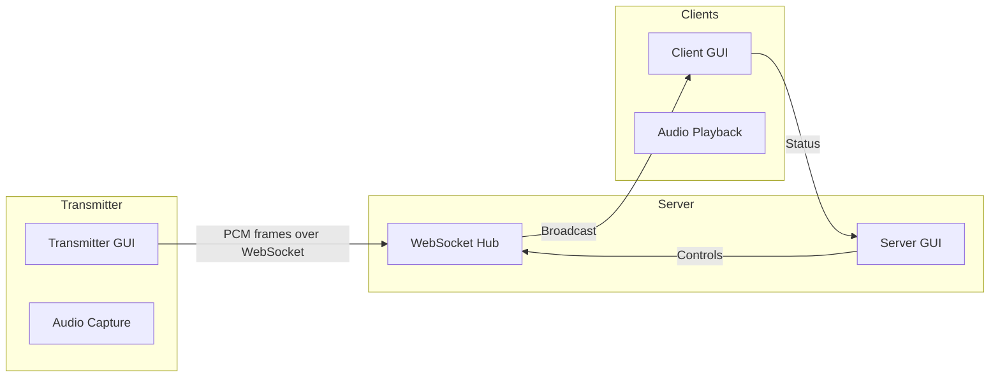

# Realtime Audio Suite

A Python-based realtime audio streaming solution designed for up to 40 connected devices. The suite is composed of three GUI applications:

- **Server GUI**: Manages client connections and distributes audio streams.
- **Transmitter GUI**: Captures audio from a local input device and streams it to the server.
- **Client GUI**: Receives audio from the server and plays it back locally.

## Architecture Overview



### Components

- **`common/`**: Shared utilities for configuration, audio framing, and logging.
- **`server/`**: Asyncio-based WebSocket server broadcasting audio frames, with a Tkinter GUI for monitoring connections and controlling the stream.
- **`transmitter/`**: Captures audio using `sounddevice`, packages PCM frames, and streams them to the server. The Tkinter GUI provides level meters and connection controls.
- **`client/`**: Connects to the server, buffers incoming audio frames, and plays them back using `sounddevice`, with GUI indicators for latency and connection status.

### Networking Protocol

Audio is captured as 16-bit PCM at 48 kHz mono, chunked into 20 ms frames. Frames are encoded as base64 JSON payloads sent over secure WebSockets. The server maintains up to 40 concurrent client sessions, broadcasting incoming frames to all subscribers. Heartbeat pings keep connections alive and measure round-trip latency.

### Scaling Considerations

- **Bandwidth**: Each stream frame (~1920 bytes) transmitted 50 times per second ≈ 96 KB/s per client. With 40 clients, expected broadcast throughput ≈ 3.8 MB/s.
- **Latency**: Ring buffers on clients maintain ~60 ms jitter buffering.
- **Threading**: GUI operations run on the main thread; audio capture/playback run in worker threads feeding asyncio queues.

## Project Layout

```
realtime-audio-suite/
├── README.md
├── requirements.txt
├── common/
│   ├── __init__.py
│   ├── audio.py
│   ├── config.py
│   ├── logging_utils.py
│   └── protocol.py
├── server/
│   ├── __init__.py
│   ├── main.py
│   └── gui.py
├── transmitter/
│   ├── __init__.py
│   ├── main.py
│   └── gui.py
└── client/
    ├── __init__.py
    ├── main.py
    └── gui.py
```

## Next Steps

1. Implement shared utilities in `common/`.
2. Build the WebSocket server and GUI in `server/`.
3. Implement transmitter capture logic and GUI.
4. Implement client playback logic and GUI.
5. Provide detailed installation and usage guide.
